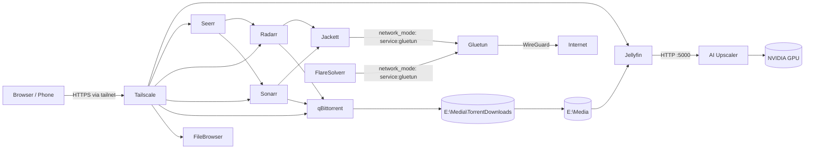

# Home Media Server

A self-hosted media stack running on Docker Desktop for Windows. Each service lives
in its own folder with its own `docker-compose.yml` and a local `config/` bind mount,
so services can be started, stopped, and updated independently.

Media lives on `E:\Media`; torrent downloads land in `E:\Media\TorrentDownloads`.
Remote access is handled by Tailscale — no ports are forwarded on the router.

> **Jellyfin is now installed natively on Windows.** It was moved out of Docker
> because NVIDIA hardware decoding did not work properly in the container. The
> `jellyfin/` directory is retained as a record of the previous Docker setup.

---

## Services

| Service | Folder | Image | Local URL | Purpose |
|---|---|---|---|---|
| Jellyfin | [jellyfin](jellyfin/docker-compose.yml) | `jellyfin/jellyfin` | http://localhost:8096 | Media server (NVIDIA hardware transcoding) |
| qBittorrent | [qbittorrent](qbittorrent/docker-compose.yml) | `qbittorrentofficial/qbittorrent-nox` | http://localhost:8080 | Torrent client |
| Jackett | [jackett](jackett/docker-compose.yml) | `lscr.io/linuxserver/jackett` | http://localhost:9117 | Indexer proxy (behind VPN) |
| FlareSolverr | [jackett](jackett/docker-compose.yml) | `ghcr.io/flaresolverr/flaresolverr` | http://localhost:8191 | Cloudflare challenge solver (behind VPN) |
| Gluetun | [jackett](jackett/docker-compose.yml) | `qmcgaw/gluetun` | — | WireGuard VPN gateway for Jackett/FlareSolverr |
| Radarr | [radarr](radarr/docker-compose.yml) | `lscr.io/linuxserver/radarr` | http://localhost:7878 | Movie automation |
| Sonarr | [sonarr](sonarr/docker-compose.yml) | `lscr.io/linuxserver/sonarr` | http://localhost:8989 | TV automation |
| Seerr | [seerr](seerr/docker-compose.yml) | `ghcr.io/seerr-team/seerr` | http://localhost:5055 | Request portal |
| AI Upscaler | [ai-upscaler](ai-upscaler/docker-compose.yml) | `kuscheltier/jellyfin-ai-upscaler` | http://localhost:5000 | AI upscaling service for the Jellyfin Upscaler plugin (NVIDIA CUDA) |
| File Browser | [filebrowser](filebrowser/docker-compose.yml) | `filebrowser/filebrowser` | http://localhost:8082 | Web file manager for `E:\Media` |
| Tailscale | [tailscale](tailscale/docker-compose.yml) | `tailscale/tailscale` | — | HTTPS reverse proxy + remote access |

### Port map

| Port | Service |
|---|---|
| 5000 | AI Upscaler |
| 5055 | Seerr |
| 6881 (TCP/UDP) | qBittorrent peer traffic |
| 6882 (TCP/UDP) | Gluetun peer traffic |
| 7878 | Radarr |
| 8080 | qBittorrent Web UI |
| 8082 | File Browser |
| 8096 | Jellyfin |
| 8191 | FlareSolverr |
| 8989 | Sonarr |
| 9117 | Jackett |

---

## Architecture



Jackett and FlareSolverr have no network stack of their own — they share Gluetun's,
so all indexer traffic exits through the WireGuard tunnel. If Gluetun stops, those
two containers lose connectivity entirely (fail-closed).

---

## AI Upscaler

Old DVD rips, SD TV episodes, and 720p files look soft on a 4K TV. The AI Upscaler
container runs neural-network super-resolution (Real-ESRGAN, SPAN, SwinIR, and ~74
other ONNX models) on the NVIDIA GPU so that content can be enlarged to HD/4K with
real detail instead of a blurry stretch.

It is the backend half of the
[JellyfinUpscalerPlugin](https://github.com/Kuschel-code/JellyfinUpscalerPlugin). The
plugin itself is tiny and ships no native libraries; it sends frames over HTTP to this
container, which owns the CUDA/ONNX stack. That split is why the AI runs in Docker
even though Jellyfin does not — it keeps the GPU inference isolated from the media
server.

What it is used for:

- **Batch pre-upscaling** — a Jellyfin scheduled task scans the library nightly for
  files below a resolution threshold and writes an upscaled copy alongside the
  original (`Movie_upscaled.mkv`). Best quality, and it plays on every client
  including TVs and phones.
- **Real-time upscaling during playback** — frames from the web player are enhanced
  on the fly. Browser-only (Chrome/Edge/Firefox); it falls back to a WebGL sharpening
  shader if the server cannot keep up with the frame rate.
- **Artwork upscaling** — a weekly task enlarges low-resolution posters, backdrops,
  logos, and banners.
- **Face restoration, film-grain handling, and colour/filter presets** applied as part
  of the upscale pass.

Operational notes:

- Models are downloaded on demand into the `jellyfin-ai-models` volume; `jellyfin-ai-config`
  holds the API token state and must survive container recreates (never `down -v` here).
- Named volumes are used instead of a `config/` bind mount because the model cache grows
  to several GB.
- Health and GPU diagnostics: `http://localhost:5000/health` and `/gpu-verify`. The model
  management web UI is at http://localhost:5000.
- Batch upscaling saturates the GPU for hours. It is scheduled overnight so it does not
  compete with Jellyfin's hardware transcoding.

---

## Prerequisites

- Windows with [Docker Desktop](https://www.docker.com/products/docker-desktop/) and the WSL 2 backend
- An `E:\Media` drive (or edit the bind mounts in each compose file)
- NVIDIA GPU + drivers for Jellyfin hardware transcoding (optional — remove the
  `runtime: nvidia` and `deploy.resources` blocks from
  [jellyfin/docker-compose.yml](jellyfin/docker-compose.yml) if you do not have one).
  The AI Upscaler also needs it; without an NVIDIA GPU, swap its image for one of the
  `docker7-intel` / `docker7-amd` / `docker7-cpu` variants
- A WireGuard VPN subscription for Gluetun
- A Tailscale account for remote access

---

## Getting started

Start an individual service:

```powershell
cd C:\Users\devra\docker\jellyfin
docker compose up -d
```

Start everything:

```powershell
cd C:\Users\devra\docker
Get-ChildItem -Directory | ForEach-Object { docker compose -f "$($_.FullName)\docker-compose.yml" up -d }
```

View logs / stop a service:

```powershell
docker compose logs -f
docker compose down
```

### First-run configuration

1. **Jellyfin** — complete the setup wizard, add libraries from `/Media`.
2. **Jackett** — add indexers, copy the API key.
3. **qBittorrent** — set the download path to `/Media/TorrentDownloads`. The initial
   admin password is printed in the container logs on first start.
4. **Radarr / Sonarr** — add Jackett as an indexer and qBittorrent as the download
   client, then point the root folder at `/Media`.
5. **Seerr** — connect it to Jellyfin, Radarr, and Sonarr.
6. **Tailscale** — follow [tailscale/README.md](tailscale/README.md).
7. **AI Upscaler** — in Jellyfin, add the plugin repository
   `https://raw.githubusercontent.com/Kuschel-code/JellyfinUpscalerPlugin/main/repository-jellyfin.json`,
   install *AI Upscaler* from the catalog, restart Jellyfin, then set the AI Service
   URL to `http://localhost:5000` (Jellyfin runs natively on this host). The model
   management web UI is at http://localhost:5000.

Because Jackett runs on Gluetun's network namespace, Radarr and Sonarr must reach it
via the host (`http://host.docker.internal:9117`), not by container name.

---

## Remote access

Tailscale publishes each app under its own HTTPS hostname with a real Let's Encrypt
certificate, so nothing is exposed to the public internet:

| App | Tailscale URL |
|---|---|
| Jellyfin | `https://jellyfin.<tailnet>.ts.net` |
| qBittorrent | `https://qbittorrent.<tailnet>.ts.net` |
| Sonarr | `https://sonarr.<tailnet>.ts.net` |
| Radarr | `https://radarr.<tailnet>.ts.net` |
| Seerr | `https://seerr.<tailnet>.ts.net` |
| File Browser | `https://filebrowser.<tailnet>.ts.net` |

Routing is defined in [tailscale/serve-config.json](tailscale/serve-config.json).
Full setup instructions are in [tailscale/README.md](tailscale/README.md).

---

## Updating

[Update_Docker_Images.bat](Update_Docker_Images.bat) pulls the latest image for every
service, recreates the containers, and prunes dangling images:

```powershell
.\Update_Docker_Images.bat
```

Never run `docker compose down -v` in the `tailscale` folder — the `tailscale-state`
volume holds the node identity and advertised services; removing it forces a re-auth.

---

## Security notes

- **Rotate the WireGuard keys.** `WIREGUARD_PRIVATE_KEY` and `WIREGUARD_PRESHARED_KEY`
  are currently hardcoded in [jackett/docker-compose.yml](jackett/docker-compose.yml).
  Move them into a `.env` file (referenced as `${WIREGUARD_PRIVATE_KEY}`) and treat the
  existing values as compromised if this folder has ever been shared or committed.
- **Do not commit secrets.** Add a `.gitignore` covering `.env`, `*/config/`, and
  `tailscale/.env` before putting this in version control. Service configs contain API
  keys and credentials.
- **`PUID=0` / `privileged: true`** in the Radarr, Sonarr, and qBittorrent compose files
  run those containers as root with elevated privileges. Prefer a non-root UID/GID
  (for example `1000:1000`, as Jellyfin and File Browser use) and drop `privileged`
  unless a specific feature requires it.
- **Set a strong password on every web UI**, especially qBittorrent and File Browser,
  since they are reachable over the tailnet.

---

## Layout

```
docker/
├── Update_Docker_Images.bat   # pull + recreate every service
├── ai-upscaler/               # AI upscaling service for the Jellyfin plugin
├── filebrowser/
├── jackett/                   # gluetun + jackett + flaresolverr
├── jellyfin/
├── qbittorrent/
├── radarr/
├── seerr/
├── sonarr/
└── tailscale/
```

Each service folder holds a `docker-compose.yml` and a `config/` directory that is
bind-mounted into the container. Those `config/` directories are the ones worth
backing up.
