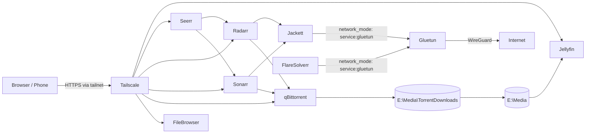

# Docker Stacks

Self-hosted services running on Docker Desktop for Windows with the WSL 2 backend.
Each service lives in its own folder with its own `docker-compose.yml` and a local
`config/` bind mount, so services can be started, stopped, and updated independently.

The stacks fall into two unrelated groups:

| Group | Services | Purpose |
|---|---|---|
| [Home Media Server](#home-media-server) | qBittorrent, Jackett, FlareSolverr, Gluetun, Radarr, Sonarr, Seerr, File Browser, Tailscale | Acquire, organise, and stream media |
| [Other Services](#other-services) | ComfyUI | Everything unrelated to the media server |

Shared setup, update, and security guidance is in
[Common operations](#common-operations).

---

## Home Media Server

Media lives on `E:\Media`; torrent downloads land in `E:\Media\TorrentDownloads`.
Remote access is handled by Tailscale — no ports are forwarded on the router.

> **Jellyfin is installed natively on Windows, not in Docker.** It was moved out
> because NVIDIA hardware decoding did not work properly in the container. Tailscale
> still proxies it, reaching the host at `host.docker.internal:8096`.

### Services

| Service | Folder | Image | Local URL | Purpose |
|---|---|---|---|---|
| Jellyfin | native install (no compose file) | — | http://localhost:8096 | Media server (NVIDIA hardware transcoding) |
| qBittorrent | [qbittorrent](qbittorrent/docker-compose.yml) | `qbittorrentofficial/qbittorrent-nox` | http://localhost:8080 | Torrent client |
| Jackett | [jackett](jackett/docker-compose.yml) | `lscr.io/linuxserver/jackett` | http://localhost:9117 | Indexer proxy (behind VPN) |
| FlareSolverr | [jackett](jackett/docker-compose.yml) | `ghcr.io/flaresolverr/flaresolverr` | http://localhost:8191 | Cloudflare challenge solver (behind VPN) |
| Gluetun | [jackett](jackett/docker-compose.yml) | `qmcgaw/gluetun` | — | WireGuard VPN gateway for Jackett/FlareSolverr |
| Radarr | [radarr](radarr/docker-compose.yml) | `lscr.io/linuxserver/radarr` | http://localhost:7878 | Movie automation |
| Sonarr | [sonarr](sonarr/docker-compose.yml) | `lscr.io/linuxserver/sonarr` | http://localhost:8989 | TV automation |
| Seerr | [seerr](seerr/docker-compose.yml) | `ghcr.io/seerr-team/seerr` | http://localhost:5055 | Request portal |
| File Browser | [filebrowser](filebrowser/docker-compose.yml) | `filebrowser/filebrowser` | http://localhost:8082 | Web file manager for `E:\Media` |
| Tailscale | [tailscale](tailscale/docker-compose.yml) | `tailscale/tailscale` | — | HTTPS reverse proxy + remote access |

### Port map

| Port | Service |
|---|---|
| 5055 | Seerr |
| 6881 (TCP/UDP) | qBittorrent peer traffic |
| 6882 (TCP/UDP) | Gluetun peer traffic |
| 7878 | Radarr |
| 8080 | qBittorrent Web UI |
| 8082 | File Browser |
| 8096 | Jellyfin |
| 8191 | FlareSolverr |
| 8989 | Sonarr |
| 9117 | Jackett |

### Architecture



Jackett and FlareSolverr have no network stack of their own — they share Gluetun's,
so all indexer traffic exits through the WireGuard tunnel. If Gluetun stops, those
two containers lose connectivity entirely (fail-closed).

### First-run configuration

1. **Jellyfin** — complete the setup wizard, add libraries from `/Media`.
2. **Jackett** — add indexers, copy the API key.
3. **qBittorrent** — set the download path to `/Media/TorrentDownloads`. The initial
   admin password is printed in the container logs on first start.
4. **Radarr / Sonarr** — add Jackett as an indexer and qBittorrent as the download
   client, then point the root folder at `/Media`.
5. **Seerr** — connect it to Jellyfin, Radarr, and Sonarr.
6. **Tailscale** — follow [tailscale/README.md](tailscale/README.md).

Because Jackett runs on Gluetun's network namespace, Radarr and Sonarr must reach it
via the host (`http://host.docker.internal:9117`), not by container name.

### Remote access

Tailscale publishes each app under its own HTTPS hostname with a real Let's Encrypt
certificate, so nothing is exposed to the public internet:

| App | Tailscale URL |
|---|---|
| Jellyfin | `https://jellyfin.<tailnet>.ts.net` |
| qBittorrent | `https://qbittorrent.<tailnet>.ts.net` |
| Sonarr | `https://sonarr.<tailnet>.ts.net` |
| Radarr | `https://radarr.<tailnet>.ts.net` |
| Seerr | `https://seerr.<tailnet>.ts.net` |
| File Browser | `https://filebrowser.<tailnet>.ts.net` |

Routing is defined in [tailscale/serve-config.json](tailscale/serve-config.json).
Full setup instructions are in [tailscale/README.md](tailscale/README.md).

---

## Other Services

Anything not part of the media server lives here, whether or not it is AI related. A
service only gets its own top-level section if it grows large enough to need one.

| Service | Folder | Image | Local URL | Purpose |
|---|---|---|---|---|
| ComfyUI | [comfyui](comfyui/docker-compose.yml) | `mmartial/comfyui-nvidia-docker` | http://localhost:8188 | Local text-to-image generation (FLUX.1-dev) |

### ComfyUI

A node-based diffusion UI running FLUX.1-dev with FP8 weights, sized for the 16 GB
RTX 5080. Full setup, model downloads, and troubleshooting live in
[comfyui/README.md](comfyui/README.md).

Points that differ from the media services:

- **Bound to `127.0.0.1:8188`, not `0.0.0.0`.** ComfyUI has no authentication of its
  own, so it is deliberately *not* published to the tailnet. Add it to
  [tailscale/serve-config.json](tailscale/serve-config.json) only if you accept that
  anyone on the tailnet gets unauthenticated access to the GPU and filesystem.
- **No `config/` directory.** The ComfyUI source and its Python virtual environment
  live in the `comfyui-run` named volume, because a Python venv on a Windows bind
  mount is slow and breaks on permissions. User files (models, input, output,
  custom_nodes) are in `comfyui/basedir/`, which is the part worth backing up.
- **The container runs as UID/GID 1000** and refuses to start if a mount is owned by
  anyone else. [comfyui/setup-folders.ps1](comfyui/setup-folders.ps1) creates the
  folders and applies the required ownership.
- **First start takes a long time** — a ~19 GB image plus a multi-GB PyTorch/CUDA
  install. It is ready when the log prints `To see the GUI go to: http://0.0.0.0:8188`.
- **Model weights are not included.** FLUX.1-dev requires a Hugging Face account and
  licence acceptance; see the ComfyUI README.

---

## Common operations

### Prerequisites

- Windows with [Docker Desktop](https://www.docker.com/products/docker-desktop/) and the WSL 2 backend
- An `E:\Media` drive for the media stack (or edit the bind mounts in each compose file)
- A WireGuard VPN subscription for Gluetun
- A Tailscale account for remote access
- An NVIDIA GPU with a current driver, required by ComfyUI and by Jellyfin's native
  hardware transcoding. Verify container GPU access with:
  ```powershell
  docker run --rm --gpus all nvidia/cuda:12.8.0-base-ubuntu22.04 nvidia-smi
  ```

### Getting started

Start an individual service:

```powershell
cd C:\Users\devra\docker\qbittorrent
docker compose up -d
```

Start everything:

```powershell
cd C:\Users\devra\docker
Get-ChildItem -Directory | ForEach-Object { docker compose -f "$($_.FullName)\docker-compose.yml" up -d }
```

View logs / stop a service:

```powershell
docker compose logs -f
docker compose down
```

### Updating

[Update_Docker_Images.bat](Update_Docker_Images.bat) pulls the latest image for every
service, recreates the containers, and prunes dangling images:

```powershell
.\Update_Docker_Images.bat
```

Tailscale's persistent state volume is preserved during updates so its node identity
and advertised services are not lost. Never run `docker compose down -v` in the
`tailscale` folder — the `tailscale-state` volume holds the node identity and
advertised services; removing it forces a re-auth.

The same applies to `comfyui`: `down -v` would delete the `comfyui-run` volume and
force a full multi-GB reinstall of ComfyUI and PyTorch.

### Security notes

- **Secrets live in `.env` files, never in compose.** [.gitignore](.gitignore) excludes
  every `.env` (and the `config/`, `cache/`, `logs/` state directories) while keeping the
  `.env.example` templates tracked. Current secret files:

  | File | Template | Holds |
  |---|---|---|
  | `jackett/.env` | [jackett/.env.example](jackett/.env.example) | WireGuard private + preshared key |
  | `tailscale/.env` | [tailscale/.env.example](tailscale/.env.example) | Tailscale auth key |

- **`PUID=0` / `privileged: true`** in the Radarr, Sonarr, and qBittorrent compose files
  run those containers as root with elevated privileges. Prefer a non-root UID/GID
  (for example `1000:1000`, as File Browser and ComfyUI use) and drop `privileged`
  unless a specific feature requires it.
- **Set a strong password on every web UI**, especially qBittorrent and File Browser,
  since they are reachable over the tailnet.
- **Keep ComfyUI on `127.0.0.1`** unless you add authentication in front of it.

### Layout

```
docker/
├── Update_Docker_Images.bat   # pull + recreate every service
├── comfyui/                   # ComfyUI + FLUX.1-dev (not media related)
├── filebrowser/
├── jackett/                   # gluetun + jackett + flaresolverr
├── qbittorrent/
├── radarr/
├── seerr/
├── sonarr/
└── tailscale/
```

Each media service folder holds a `docker-compose.yml` and a `config/` directory that
is bind-mounted into the container. Those `config/` directories are the ones worth
backing up, along with `comfyui/basedir/`.

